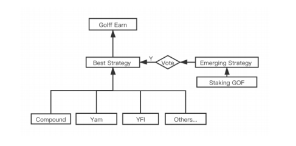
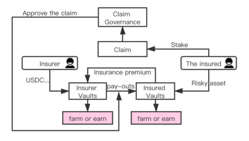

# Golff Introduction

?> Golff--One-Stop Services Encrypted Bank

## Vision of Golff

DeFi is the first application in the decentralized world after Bitcoin. We believe that DeFi will step out of the Crypto circle in future and become the trending of open finance! The Golff team members have been deeply involved in the blockchain for a long time, and have a keen insight into the industry and strong executive ability. We believe that everyone should have equal access to high-quality financial products and services. Then Golff was born!

Golff is postioned as a one-stop services encrypted bank, committing to creating a light, open and free financial world where everyone can participate. At this time, we are standing at the starting point of the DeFi explosion, facing the vast future of the DeFi world.

## Golff Brings A New Experience To the DeFi Market 

#### 1.Low threshold, fast and smooth product experience

"One-Stop"product experience lowers the user threshold and allows users to smoothly complete the financing process. Golff adopted two solutions to avoid the problem of Ethereum blockage that affects user experience. One is to recommend users to use the Rollup type of Layer 2 network (Layer 2), and the other is to support public chains with better performance, such as GXChain, through support of cross-chain operations.

#### 2.Multi-version, localized product design, simultaneously catering to the needs of Eastern and Western users

DeFi products are by nature open financial systems operating without borders. Users from all over the world should have a chance to participate in this ecosystem together. In order to provide users an experience that adapts to their respective cultures and habits, Golff is committed to introduce a more localized experience and UI design. This also allows Golff to overwhelm its competition in terms of product experience, attracting users and funds.

#### 3.Innovative gameplay to increase return while increasing user stickiness

As a DeFi aggregator, Golff will continue to innovate product design and gameplay while optimizing and aggregating the DeFi product portfolio to optimize return. Golff allow users to obtain financial benefits while also having social attributes and game-like experiences, thereby greatly improving user stickiness.

#### 4.A full range of products to create a financial giant in blockchains

A DeFi product is a container of funds, and the size of the funds largely determines its value. To attract and retain funds in a DeFi container, it is important to meet the varying needs of different funds. To this end, Golff is created as a full-service DeFi product, serving a full range of financial needs, including liquidity mining, financial management, insurance, lending, derivatives, etc. 

## Golff Products 

#### 1.Fantastic Farm-- Liqudity Mining 

In the first phase, Golff generates the initial governance token GOF through liquidity mining, and aims to attract a large number of users and funds to participate in this financial experiment. Compared to existing DeFi methods, generating initial tokens through liquidity mining is fairer and more transparent, which can help Golff to acquire initial users quickly. Follow-up products of Golff, will prioritize liquidity mining and behavioral mining as methods to incentivize its customers. 

Golff's liquidity mining will be divided into multiple stages. While mining to obtain high profits, it will have a stronger sense of game experience and fun, and encourage users to participate more and more continuously.

#### 2.Golff Vault Earning Collection

Golff earning collection is an income aggregator that automatically selects the highest return, siphoning the value of each DeFi product. Its goal is to maximize the income for holding assets in a non-destructive way. 

Golff Earning Collection automatically provides a list of revenue strategies that are considered to be the best in the current market based on programmatic screening. It also finds cross-protocol arbitrage opportunities. This process effectively aggregates various DeFi products in the current market. In addition, Golff Earn also allows users to provide their own strategies (need to hold a certain GOF). With a community vote approving it as an optional income strategy, the strategy proposer can earn a share in the income from the strategy pool. 

#### 3.Financial Enhancement Insurance

Golff's insurance business, in addition to insurance, adds the aggregated farm and earn of the underwriting pool and the insured pool, which allows the insurer to obtain additional income on the basis of their income, and also allows the insured a certain benefit by transferring some risks to the insurance pool. Participating in Golff's insurance does not require KYC(Know Your Customer), and the scope of underwriting includes on-chain contracts and on-chain assets. That is, the insurance can underwrite contract security accident risks and asset credit risks. One only needs to deposit assets of stable value into the "insurer vaults"to become an insurer. The insured needs to deposit risk assets in the "insured vaults"to buy insurance. Funds in the insured pool will be regularly paid to the insured as premiums. When a risk occurs, the insured can apply for a claim to the Claims Committee. When the claim is approved, the corresponding assets in the insurer vaults is paid to the insured vaults.

#### 4.Lighting Lend

The one-click aggregation lending service launched by Golff can aggregate current mainstream DeFi lending platforms, such as MakerDAO, Compound, Dharma, dYdX, etc. This will greatly expand the underlying assets that can be used for lending, enhance the user's asset liquidity, and optimize the best interest rate, reducing the user's borrowing cost. 

"credit behaviors"in behavioral mining. The Golff team is currently working with the GXChain team to do research in on-chain unsecured credit loan agreement based on trusted oracles, which can open up a new on-chain lending market and greatly increase the scale of on-chain lending. The goal of this product is to desensitize the data of off-chain centralized data providers to calculate consumer credit risk through trusted computing, and then pass it into the credit loan agreement to link off-chain credit behavior with on-chain financial behavior.